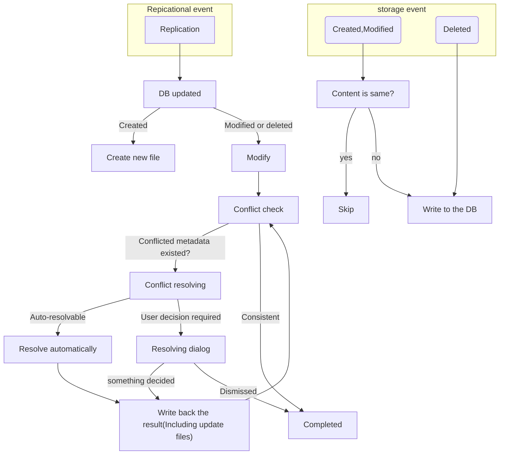

# How database and storage are synchronised?

Its based on very simple rule.

Modification will be happen so frequently while we're writing articles, we have the option `Batch Database Update`.
This option queues `Write to the DB` till switching opened file or replicating. Then we have less changeset.
And we can see a document history of `write to the DB` and `DB updated` by `Show history`(While we opening the file) or `Pick file to show history`.