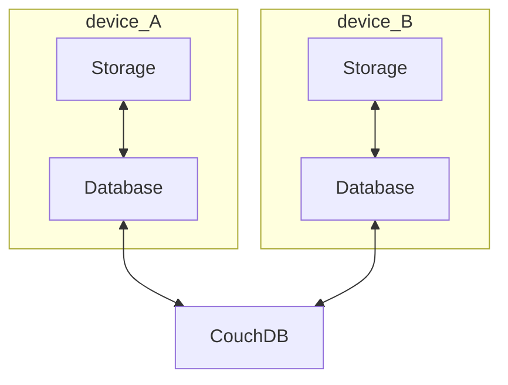
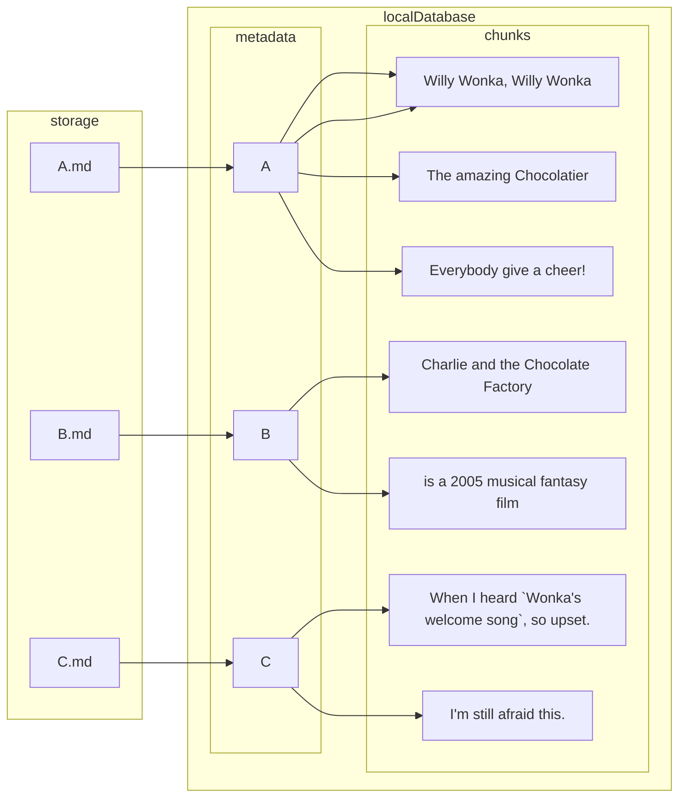
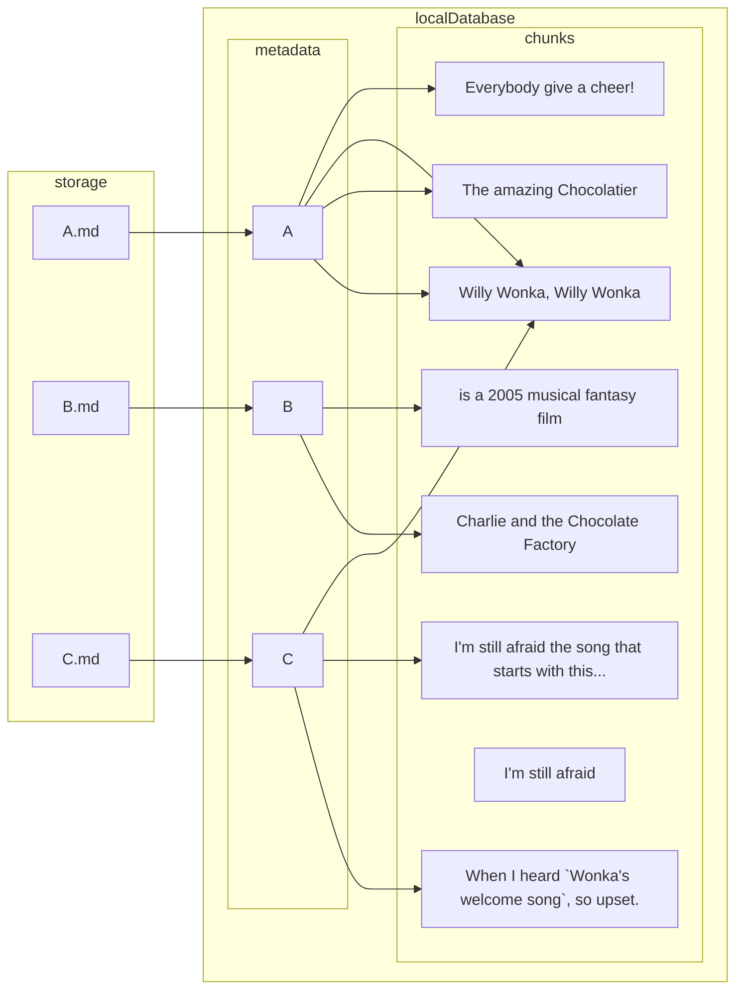

# What is the database?

LiveSync does not synchronise files directly. All files are synchronised to the local database. At this time, files are separated into two or more entries; the metadata and chunks. We call this as `differential replication` (I have decided to write this document.)
And them will be synchronised between each devices by replicating own local databases to the remote database.




Chunks are key to low-traffic replication and synchronisation. Usually, editable text-file will be split by new-line-mark. ([[SpecOfSync|Details and non-usual cases are here]])
Chunks are keyed by its contents, and all metadata has a list of chunk keys as below.


Figure 1

A: 
```
Willy Wonka, Willy Wonka
The amazing Chocolatier
Willy Wonka, Willy Wonka
Everybody give a cheer!
```

B:
```
Charlie and the Chocolate Factory
is a 2005 musucal fantasy film
```

C:
```
When I heard `Wonka's welcome song`, so upset.
I'm still afraid this.
```

After we edit the files, the metadata is usually updated and a bit of new chunks are born.
And if there already exists one made from the same contents, it will be shared.

C:
```
When I heard `Wonka's welcome song`, so upset.
I'm still afraid the song that starts with this...
Willy Wonka, Willy Wonka
```

Figure 2 (metadata `C` and chunk `When I heard...` will be transfered)

Therefore, we can transfer only the metadata and some limited chunks and keep a low bandwidth and less traffic. That enables *LiveSync*. does not cool?

As shown in Figure 2, old chunks that are not currently referenced will be left behind. So, although these chunks may one day be re-used, the database will continue to bloat.

Due to this, At some point we must rebuild the database, and it is up to us to decide when to do so. We can count how many unrefferenced-chunks are retained by the command  `Check garbages now`.

![[Pasted image 20220727123616.png]]
